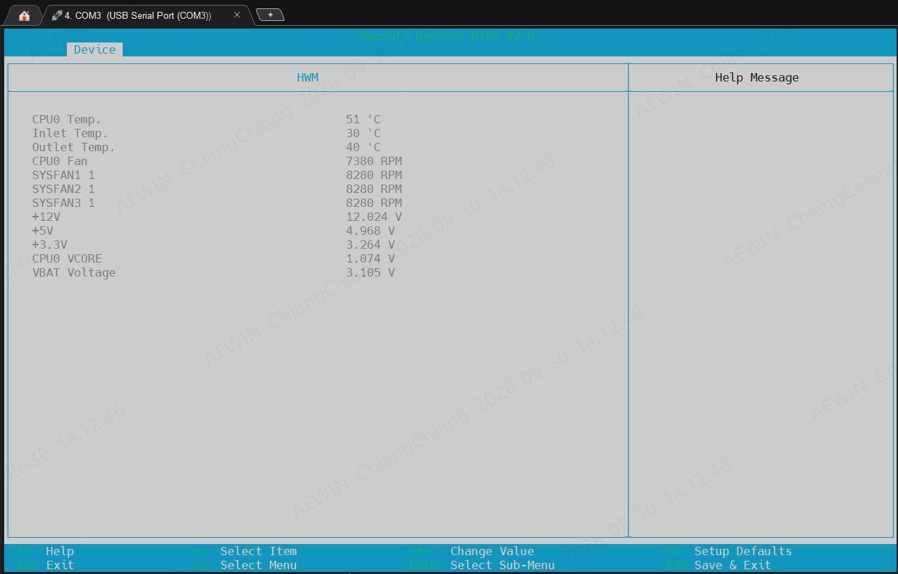

# ipmitool

```log ================================================================
[root@localhost v1.01]#   date
Wed Sep 30 14:38:50 CST 2026
[root@localhost v1.01]#  ipmitool sdr elist
CPU0_VCORE       | 00h | ok  |  0.1 | 1.07 Volts
SOC_VCORE        | 12h | ok  |  0.1 | 0.94 Volts
CLDO_VCORE       | 13h | ok  |  0.1 | 1.13 Volts
12V              | 14h | ok  |  0.1 | 12.10 Volts
5V               | 15h | ok  |  0.1 | 4.97 Volts
3P3V             | 16h | ok  |  0.1 | 3.24 Volts
3PV3_AUX         | 17h | ok  |  0.1 | 3.24 Volts
VBAT             | 18h | ok  |  0.1 | 3.12 Volts
VDDP_PHY         | 19h | ok  |  0.1 | 0.92 Volts
P1V1_WX          | 1Ah | ok  |  0.1 | 1.07 Volts
P1V1_SATA        | 1Bh | unr |  0.1 | 1.83 Volts
CPU0_Temp        | 32h | ok  |  0.1 | 44.18 degrees C
Inlet1_Temp      | 38h | ok  |  0.1 | 28.11 degrees C
Outlet1_Temp     | 39h | ok  |  0.1 | 34.14 degrees C
CPU0FAN_1        | 60h | ns  |  0.1 | No Reading
SYSFAN1_1        | 64h | ns  |  0.1 | No Reading
SYSFAN2_1        | 66h | ns  |  0.1 | No Reading
SYSFAN3_1        | 68h | ns  |  0.1 | No Reading
PSU0_Status      | 80h | ok  |  0.1 | Presence detected
PSU0_Vin         | 81h | ok  |  0.1 | 110.55 Volts
PSU0_12V         | 82h | ok  |  0.1 | 25.50 Volts
PSU0_Fan         | 83h | ok  |  0.1 | 200 RPM
PSU0_Temp        | 84h | ok  |  0.1 | 2 degrees C
PSU0_Pin         | 85h | ok  |  0.1 | 109.76 Watts
PSU0_Pout        | 86h | ok  |  0.1 | 98 Watts
PSU0_Pout_Max    | 87h | ok  |  0.1 | 0 Watts
PSU1_Status      | 90h | ok  |  0.1 | Presence detected
PSU1_Vin         | 91h | ok  |  0.1 | 110.55 Volts
PSU1_12V         | 92h | ok  |  0.1 | 25.50 Volts
PSU1_Fan         | 93h | ok  |  0.1 | 3500 RPM
PSU1_Temp        | 94h | ok  |  0.1 | 0 degrees C
PSU1_Pin         | 95h | ok  |  0.1 | 113.68 Watts
PSU1_Pout        | 96h | ok  |  0.1 | 50.96 Watts
PSU1_Pout_Max    | 97h | ok  |  0.1 | 0 Watts
ACPI_state       | A0h | ok  |  0.1 | S5/G2: soft-off
Event_log        | A2h | ok  |  0.1 |
BMC_Start        | A4h | ok  |  0.1 |
Post_Status      | D2h | ok  |  0.1 |
System_Restart_C | D7h | ok  |  0.1 |

[root@localhost v1.01]#  ipmitool sdr elist | g -v "ok"
P1V1_SATA        | 1Bh | unr |  0.1 | 1.83 Volts
CPU0FAN_1        | 60h | ns  |  0.1 | No Reading
SYSFAN1_1        | 64h | ns  |  0.1 | No Reading
SYSFAN2_1        | 66h | ns  |  0.1 | No Reading
SYSFAN3_1        | 68h | ns  |  0.1 | No Reading
####這裡system fan 硬體有轉
####BIOS monitor have value
```


